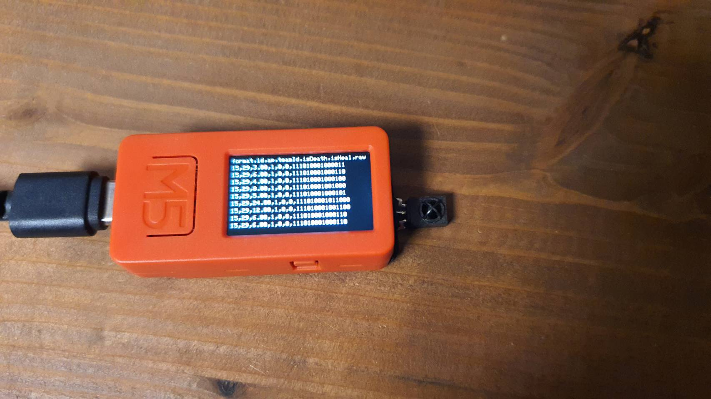
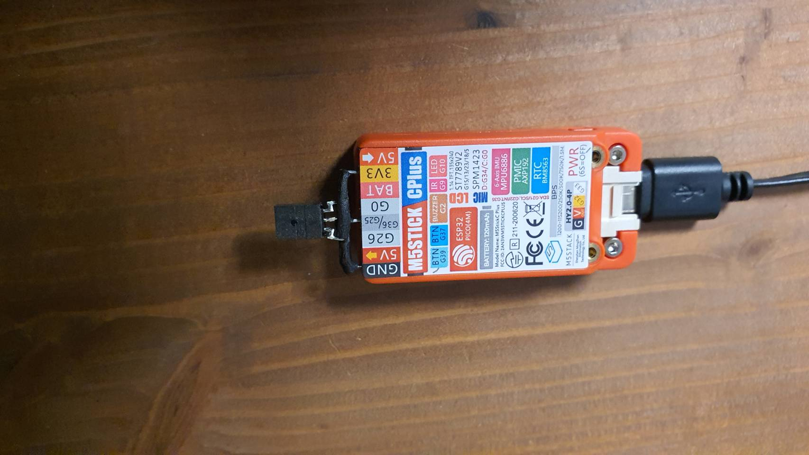

# ir-recieve-checker

赤外線リモコン信号の受信チェッカー

## 概要

新感覚忍者シューティングXSAの赤外線受信チェッカーです。\
このデバイスに向けて撃つと、受信したデータを確認することができます。

## 使用デバイス

| デバイス     | 品番          | 数量 |
| ------------ | ------------- | ---- |
| マイコン     | M5Stick-CPlus | 1    |
| 赤外受光素子 | GP1UXC41QS    | 1    |
